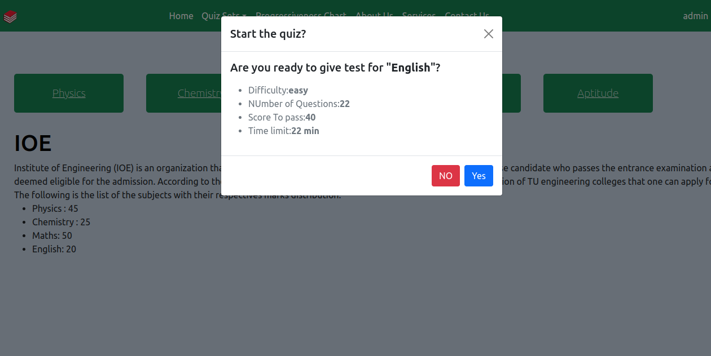
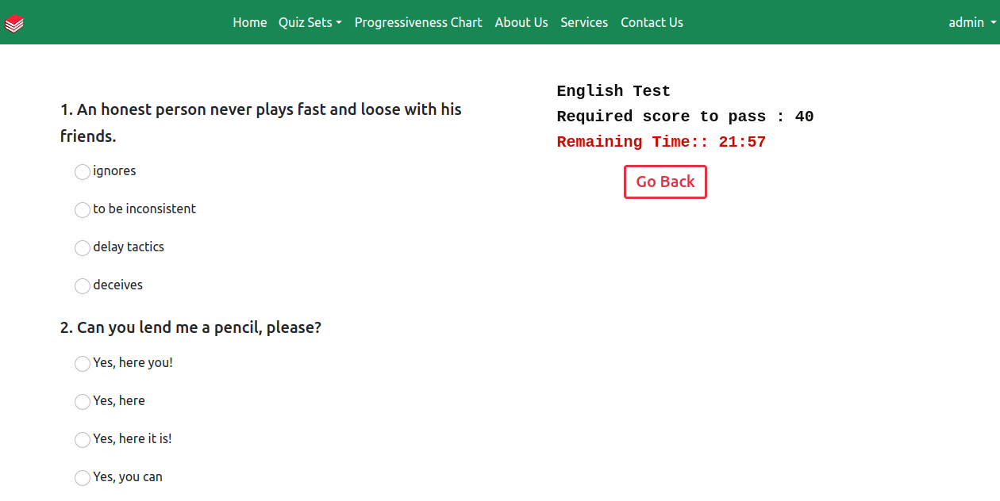
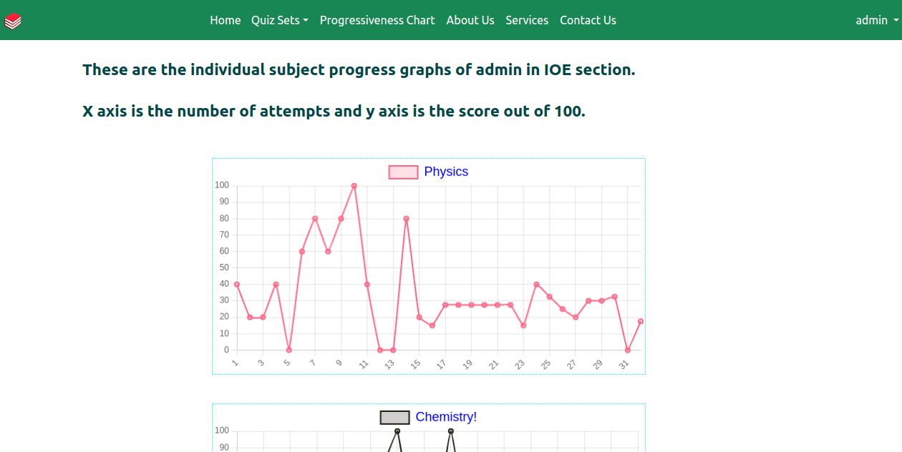

# Entrance Preparation App

This entrance preparation app has quiz functionality where students can attempt different question sets on IOE and IOM fields.
They can track their progress by creating their own account and see their progress in charts.

## Technology used:
Python, Django, Javascript, HTML, CSS

## Instructions for installation:
1. Install PostgreSQL development library: `sudo apt-get install libpq-dev`
2. Make a python environment: `virtualenv myenv` (for Windows), `python3 -m venv env`(for linux)
3. Activate the environment: `myenv\Scripts\activate`(for Windows), `source myenv/bin/activate`(Linux)
4. Install the requirements: `pip install -r requirements.txt`
5. Setup the pgadmin in your pc: [https://computingforgeeks.com/how-to-install-pgadmin-4-on-ubuntu/](https://computingforgeeks.com/how-to-install-pgadmin-4-on-ubuntu/)
6. Make a database and import the SQL file.
67. Run the following commands:
    ```
    python manage.py makemigrations
    python manage.py migrate
    python manage.py runserver
    ```

## Demo screenshots!!

<br>
<br>
<br>
<br>

## Deployment:
You can find the live working site of this project on this site: https://entranceprep.nepaldigitalmarketing.com/

## Credit
This project was completed as a part of a Minor project of the curriculum of the third year of the Department of Electronics and Computer Engineering in Pulchowk Campus.
